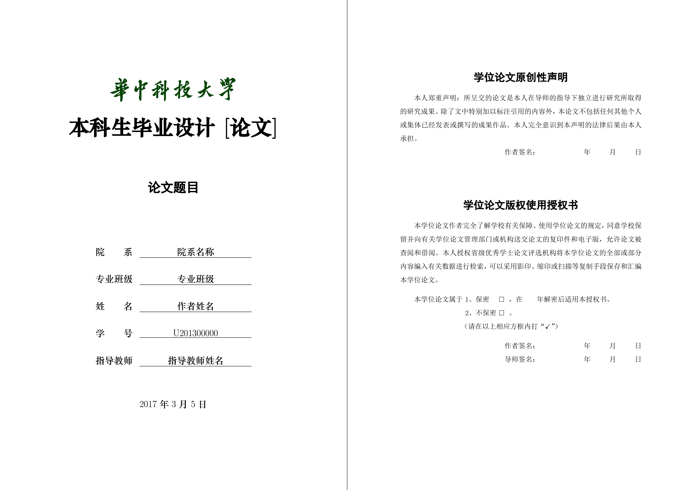

# 华中科技大学本科毕业论文LaTeX模板 2017

[English Version](README-EN.md)

本项目为非官方的华中科技大学**本科生**毕业论文LaTeX模板，考虑到目前网络上可以找到的本校模板已经严重过时，本人重新制作了该模板，符合2017年华中科技大学本科生毕业论文官方模板格式。

研究生毕业论文模板请移步[hustthesis](https://ctan.org/pkg/hustthesis)。

## 模板样例

正文样例可以参照[PDF样例文档](Example/example.pdf)

## 使用方法

请注意，本模板需要操作系统中已安装**华文中宋字体**，详情请参考[使用说明](Instruction/HGP.pdf)5.2节内容。

### 在Windows系统中
* 下载本模板[最新Release版本](https://github.com/skinaze/HUSTPaperTemp/releases)
* 下载并安装最新版本的MiKTeX(推荐，以下步骤针对MiKTeX)或者TeX Live
* 打开TeX works，并设置默认编译工具(Edit->Preference->Typesetting->Processing Tools->Default)为XeLaTeX+MakeIndex+BibTeX
* 新建一个tex文档并保存在一个文件夹下，将Template文件夹下所有文件拷贝到该文件夹下
* 在新的tex文档中使用\documentclass{HustGraduPaper}使用模板定义的样式

### 在Mac OS X系统中
* 下载本模板[最新Release版本](https://github.com/skinaze/HUSTPaperTemp/releases)
* 下载并安装最新版本的MacTeX
* 打开TeXshop，新建一个tex 文档并保存在一个文件夹下，将Template文件夹下所有文件拷贝到该文件夹下
* 在新的tex 文档中使用\documentclass{HustGraduPaper} 使用模板定义的样式
* 编写完成论文后，使用XeLaTeX->MakeIndex->BibTeX->XeLaTeX 的顺序进行编译

### 在Ubuntu系统中
* 下载本模板[最新Release版本](https://github.com/skinaze/HUSTPaperTemp/releases)
* 使用命令sudo apt-get install texlive 安装最新版TEX Live
* 新建一个.tex 文件并保存在一个文件夹下，将Template 文件夹下所有文件拷贝到该文件夹下
* 在新的tex 文档中使用\documentclass[ubuntufont]{HustGraduPaper}使用模板定义的样式，并设置使用Ubuntu 自带的文泉驿和文鼎字体
* 编写完成论文后，使用XeLaTeX->MakeIndex->BibTeX->XeLaTeX 的顺序进行编译

## 详细说明
详细说明请参考[使用说明](Instruction/HGP.pdf)，或者查看[Example文件夹](Example)下的例子。

## 问题反馈
本人因为精力原因已经无法继续维护，尤其是已经多年没有使用latex，已经有些生疏。如果有问题，可以[发邮件给我](mailto:me@stringblog.com)，我会能力之内尽量解答。

若提交Pull Requests，除非修复Bug，否则请以新的宏包选项或者命令及命令选项的方式为项目添加新的功能，以保证宏包的向下兼容性。

## 关于查重
我们学校目前使用知网系统进行查重，提交格式支持WORD和PDF。但因为XeLaTeX底层原因，PDF中部分伪加粗的字不能被识别，这个问题最好的解决方案是设置使用本身带有粗体的OpenType字体，比如Fandol字体；如果期望使用没有粗体的字体或者TrueType字体，本模板也提供了一个样式选项chachong（详见[使用说明](Instruction/HGP.pdf)），这个会在文章开头添加一页（或多页）包含比较重要的加粗字符，使XeLaTeX提前编码他们，但使用过程中需要**使用其他PDF工具删除开头多余的一页（或多页）**，推荐使用Adobe Acrobat和[smallpdf.com](https://smallpdf.com/split-pdf)。另外建议在上传知网查重前使用WORD打开PDF文件，确保"目录"、"参考文献"和声明部分WORD能够识别。

如果期望使用WORD，由于上述原因，我目前找到两种比较好的WORD的生成方案：

1. 通过Adobe Acrobat导出到Microsoft Word，这是我目前找到的唯一一个可以比较完美识别加粗字符并转换为WORD格式的工具，导出格式中的公式图片可能存在问题，但是查重不查公式图片，所以问题不大，但缺点是这个工具是收费的；
2. 通过[Pandoc](http://pandoc.org/)直接从LaTeX转换为Microsoft Word，这需要一个已经设置好各级标题样式的WORD文档作为格式参考，好处是转换结果中公式都能完整展现，坏处是需要已经设定好格式的WORD文档而且直接生成PDF脚本的命令（如各种绘图宏包）不能正常工作。

个人认为提交的WORD文档仅作为查重使用，并不需要格式完全准确，所以虽然转换得到的WORD存在各种问题，但并不会有太大影响。当然，如果对最终提交的WORD格式有近乎完美的追求，建议使用WORD直接进行论文排版。关于这个问题如果您有更好的建议也请[联系我](mailto:me@stringblog.com)。

## 未发布的更新内容
* 添加参考文献模板支持，感谢[rawfh](https://github.com/rawfh)对模板的贡献
